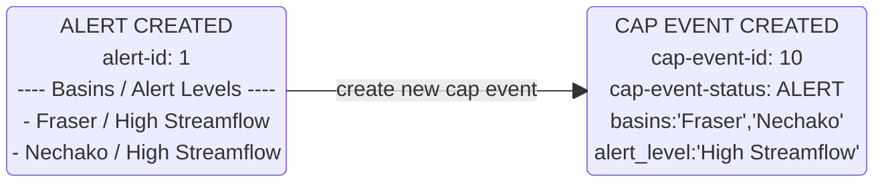
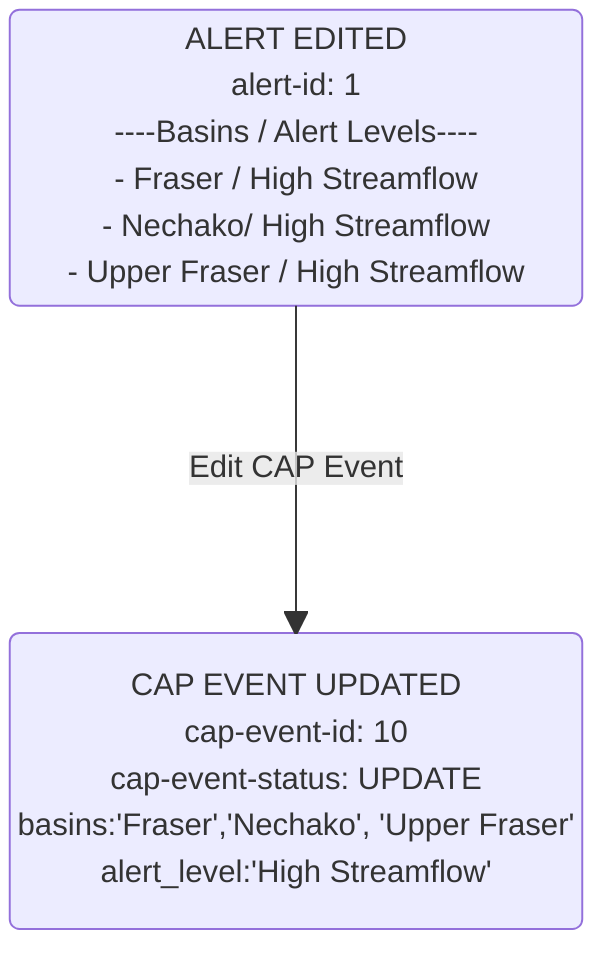
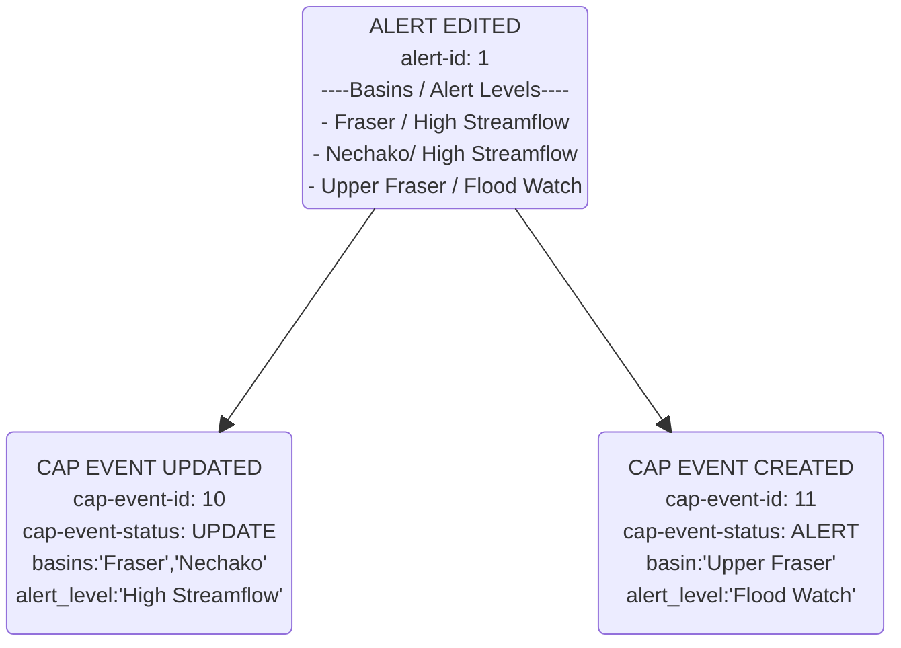
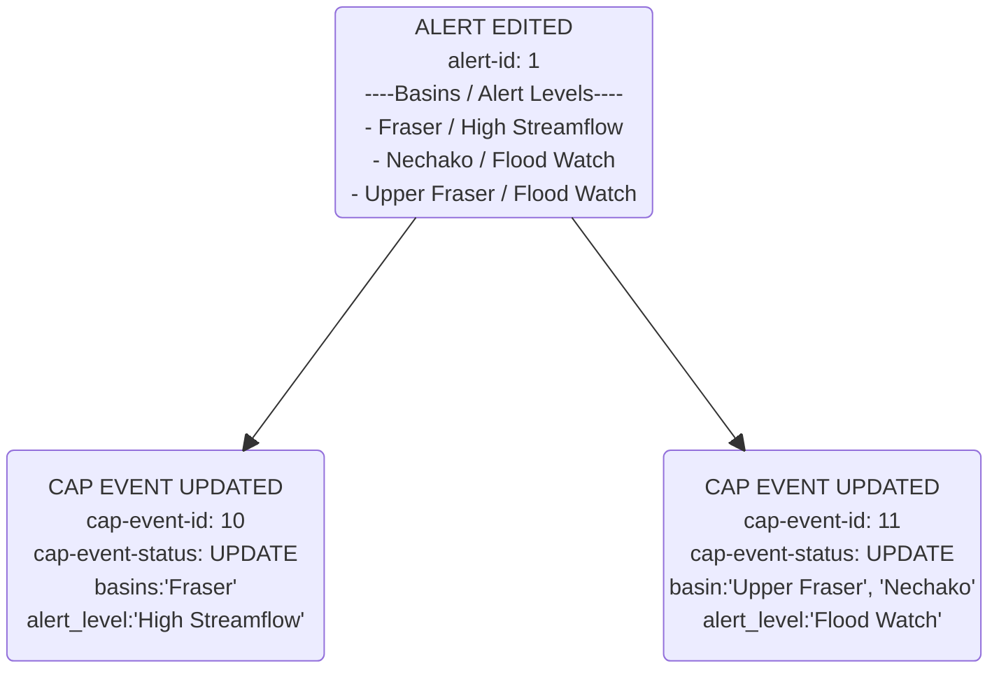
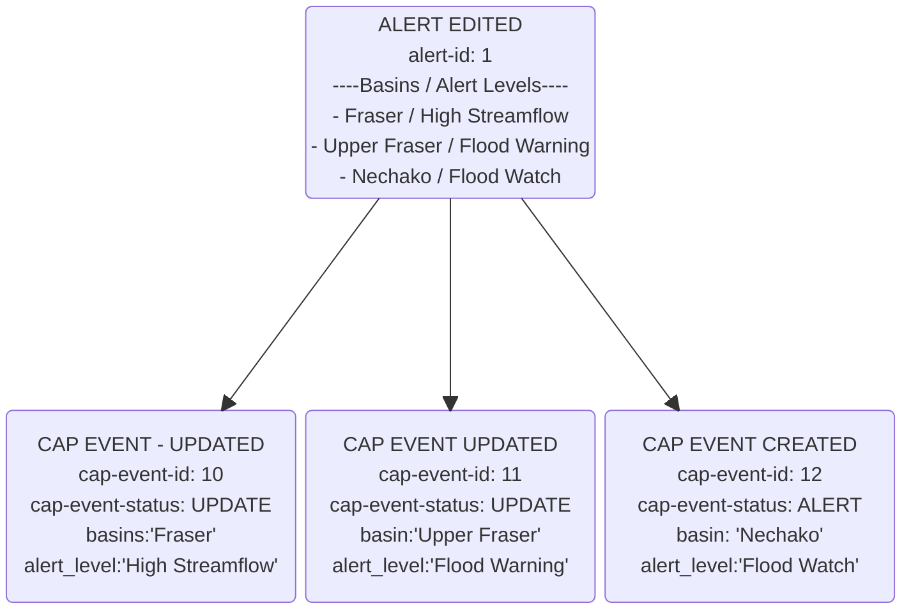
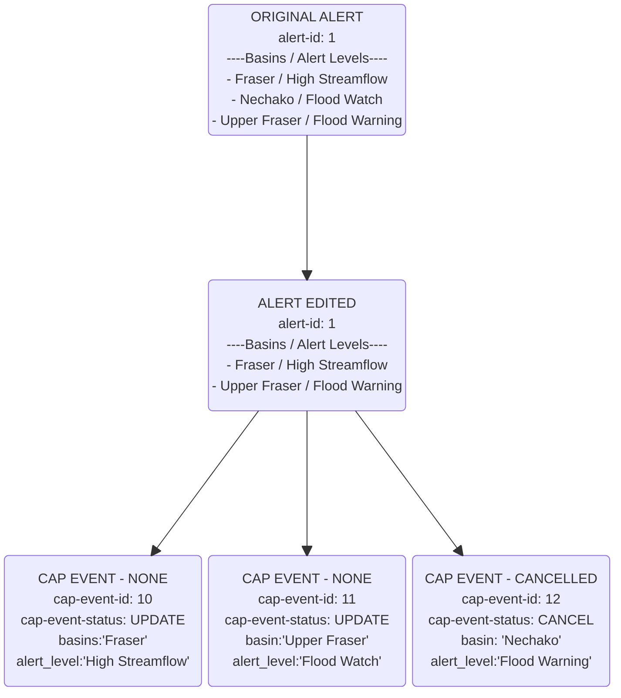
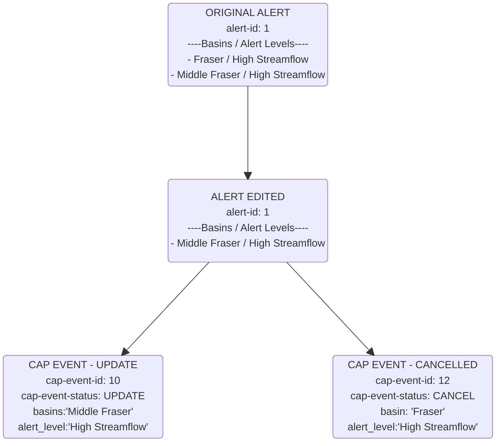
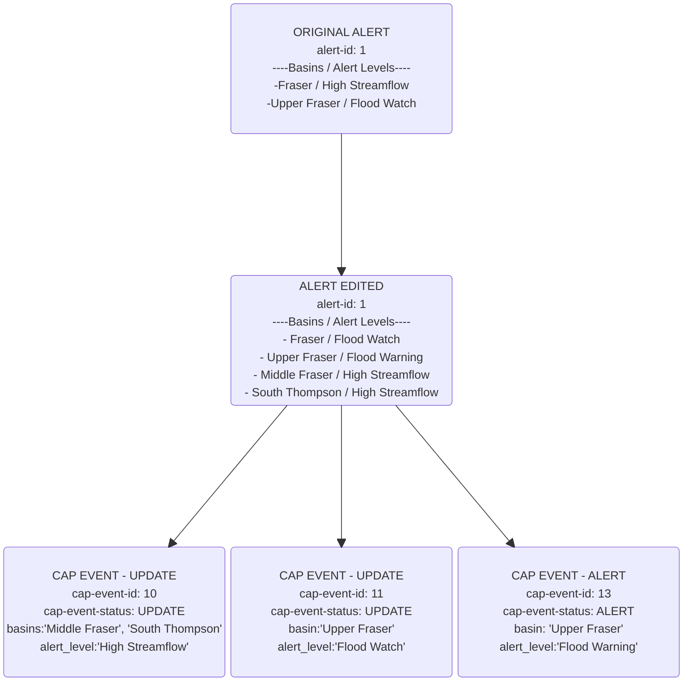

# Overview

This document identifies how changes to Alert data relate to Common Alerting Protocol
Event generation.  

The diagrams in this document portray the relationship between specific changes
to alert data and how they relate to CAP Events.  Data model relationships in 
these diagrams have been simplified and or removed in order to focus on how 
CAP events relate to Alert Events.  For more detail on the data model used to 
capture these changes see the [database documentation](../database.md)

## DataFlows

This section starts with some simple examples, and builds on them progressively

### Create Alert - Net New Alert Generation

When a net new alert is created.  The following actions take place:

* New alert record is created
* New cap event is created

In the example below, a new Alert is created for the ***Nechako*** and ***Fraser***
Basins, and the alert level for both of the basins is set to 
***"High Streamflow"***.  Creation of this alert record results in a new CAP 
record being generated for both basins at a High Streamflow level

### Advisory Edited - New Area (Basin) Added

In this example a new basin ***'Upper Fraser'*** is added to the alert.  This results
in that basin being added to the CAP Event.  At this 
stage all the basins in the alert are set to ***'High Streamflow'*** advisory level

### Advisory Edited - Alert Level Changed - 1

In this example the alert level for the basin ***Upper Fraser*** is
being upgraded to from ***high streamflow*** to ***flood watch***.  This results 
in a new CAP event to be created, with the status of the CAP to 'ALERT' and the alert 
level set to ***flood watch***

### Advisory Edited - Alert Level Changed - 2

In this example the ***Nechako*** basin will be upgrade to a ***flood watch***.  
Because the alert maintains the relationship to its related CAP events it knows
in this scenario to move the the ***Nechako*** basin from the existing CAP_EVENT 
for ***High Streamflow*** to the CAP_EVENT for ***Flood Watch***

### Advisory Edited - Alert Level Changed 3

In the Alert, the basin ***Nechako*** is being upgrade from ***Flood Watch*** to 
***Flood Warning***.  A new CAP_EVENT will be generated for the alert level 
***Flood Watch*** and the ***Nechako*** basin is added to that alert.  Nechako is then removed from the ***Flood Warning*** CAP_EVENT

### Advisory Edited - Basin Removed 1

In the Alert, ***Nechako*** is being removed to indicate there is no longer risk 
of flooding for that basin.  This generates a CAP_EVENT cancellation
for that basin.  The other two CAP_EVENTS remain unchanged.  No changes are made
to those records and no messages are generated.

Any time a basin / alert level gets removed from an ALERT a CAP Cancellation
event will be generated for that basin.

### Advisory Edited - Basin Removed 2

The incomming alert for this example has ***Fraser*** and ***Middle Fraser*** set to 
***High Streamflow*** alert level.  The alert is then edited and ***Fraser*** is 
removed from the alert.  This results in an update to ***High Streamflow*** alert
associated with ***Middle Fraser***, and a new Cancellation CAP Event to be generated
for the basin ***Fraser***

### Advisory Edited - All Actions at once

In this scenario, we leave off where the previous example started.

The incomming alert has the following basin / alert levels set
* Fraser / HSA
* Upper Fraser / Flood Watch

These are the CAP Events that were emitted from the last update:
* Fraser / High Streamflow (HSA) - No Change
* Upper Fraser / Flood Watch - No Change
* Nechako / Flood Warning - Cancel

In this scenario we will add three more basin / alert levels to the mix to 
illustrate how they will translate to cap events

* Middle Fraser - Added to alert as HSA
* South Thompson - Added to alert as HSA
* Upper Fraser - changes to Flood Warning
* Fraser - changes to Flood watch

from a cap event perspective this will 
* add Middle Fraser and South Thompson to the existing CAP event for HSA
* Move Upper fraser moves from Flood Watch CAP event to the Flood Warning CAP event
* In the previous state the 'Flood Watch' was cancelled, meaning we will generate a 
  new flood watch cap event, Notice the new CAP_EVENT_ID for flood warning
* Move Fraser from the HSA CAP event to the Flood Watch Cap Event.

## Data Flow Summary

* An Alert can have multiple Basin / Alert level combinations associated with it
* An Alert can have multiple CAP Events associated with it
* A CAP Event can only have one alert level associated with it.
* Changing the alert level associated with a basin results in either
  1. The creation of new Cap event for that alert level 
  2. If a cap event with the new alert level already exists, that event will be
    edited (updated) adding the new area to it, and removing it from other CAP events.
  3. CAP event cancellations will essentially close that cap event.  If a CAP 
     event is cancelled, and then later added back into an alert, a new CAP event
     will be created with a new CAP_EVENT_ID.
  4. Any time a basin / alert level is removed from an ALERT a CAP EVENT cancellation
     will be created for that CAP_EVENT.

Cap Event Attributes:
* Area
* Alert Level
* Cap Event Action type [ALERT, UPDATE, CANCEL, None]
* Cap Area / Basin
