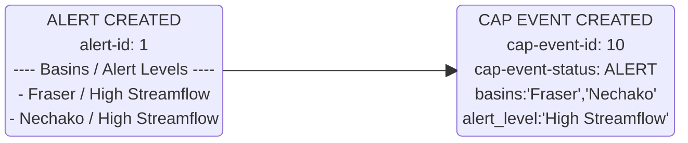
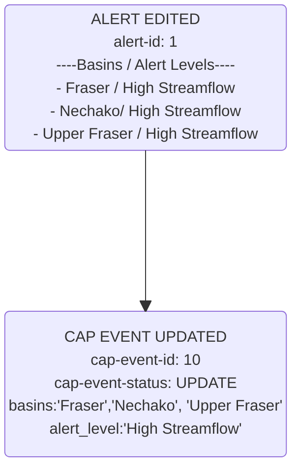
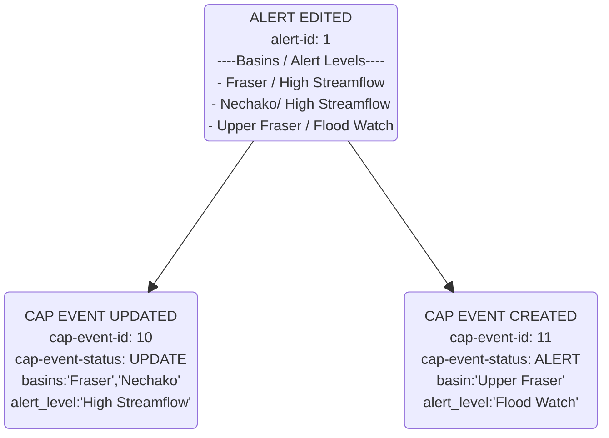
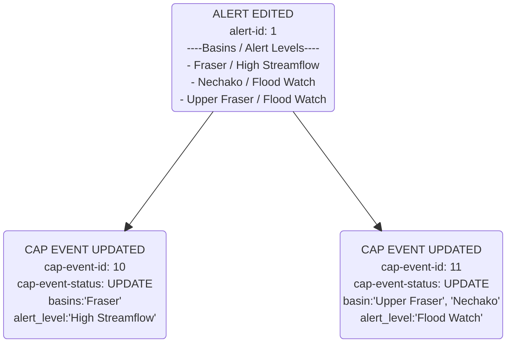
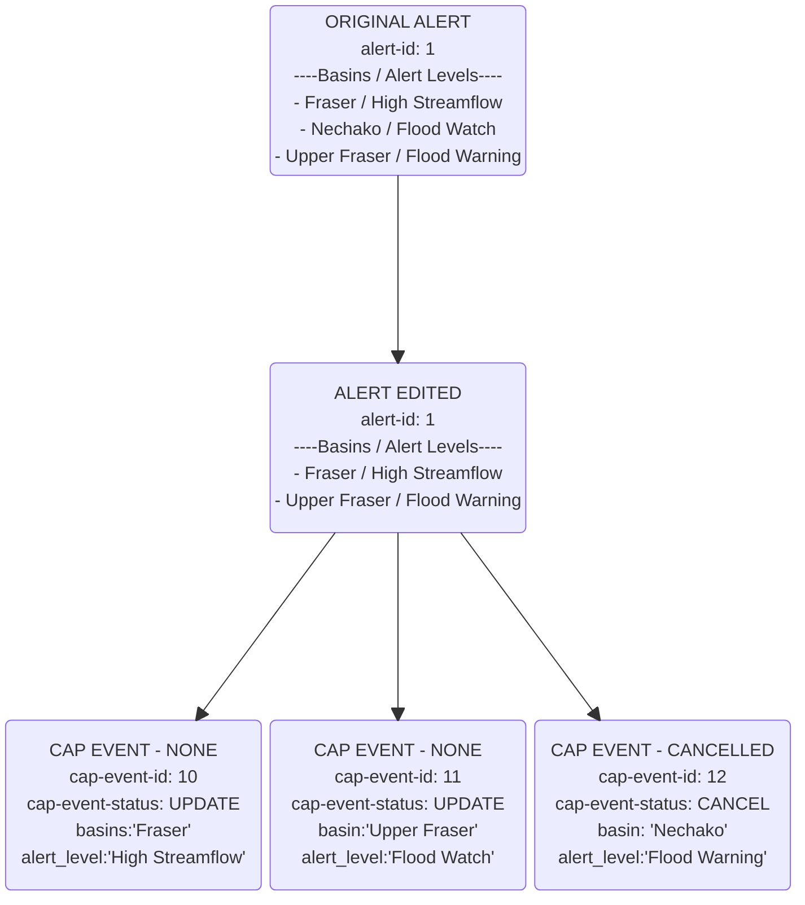

# Overview

This document attempts to identify how data will be populated and move through
the alert authoring system.

The diagrams in this document are intended to portray the relationship between
Alert Events, and Common Alert Protocol (CAP) Events.  The data models are 
simplified to illustrate the relationships, and how Alert Events translate to 
CAP events.  See the [database documentation](../database.md) for a more detailed understanding 
of the underlying data models.

## DataFlows

### Create Alert

When a net new alert is created.  The following actions take place:

* New alert record is created
* New cap event is created -> New message is sent to the a message queue

In the example below, a new Alert is created for the ***Nechako*** and ***Fraser***
Basins, and the alert level for both of the basins is set to 
***"High Streamflow"***.  Creation of this alert record results in a new cap 
record being generated.

### Advisory Edited - New Area (Basin) Added

In this example a new basin ***'Upper Fraser'*** is added to the alert.  At this 
stage all the basins are set to ***'High Streamflow'*** advisory level

### Advisory Edited - Alert Level Changed - 1

In this example the alert level for the basin ***Upper Fraser*** of the basins is
being upgraded to from ***high streamflow*** to ***flood watch***.  This will automatically trigger the creation of a new cap event.  

### Advisory Edited - Alert Level Changed - 2

In this example the ***Nechako*** basin will be upgrade to a ***flood watch***.  
Because the alert maintains the relationship to its related CAP events it knows
in this scenario to move the the ***Nechako*** basin from the existing CAP_EVENT 
for ***High Streamflow*** to the CAP_EVENT for ***Flood Watch***

### Advisory Edited - Alert Level Changed 3

Now the basin ***Nechako*** is being upgrade from ***Flood Watch*** to 
***Flood Warning***.  A new CAP_EVENT will be generated for the alert level 
***Flood Watch*** is created and the ***Nechako*** basin is removed from the 
***Flood Warning*** CAP_EVENT and added to the newly created ***Flood Watch*** 
cap event.

### Advisory Edited - Basin Removed

In this scenario the basin ***Nechako*** no longer has any alerts associated with
it.  It is removed from the ALERT record.  This generates a CAP_EVENT cancellation
for that basin.  The other two CAP_EVENTS remain unchanged.  No changes are made
to those records and no messages are generated.

### Advisory Edited - All Actions at once

In this scenario, we leave off where the previous example started.

The incomming alert has the following basin / alert levels set
* Fraser / HSA
* Upper Fraser / Flood Watch

These are the CAP Events that were emitted from the last update:
* Fraser / High Streamflow (HSA) - No Change
* Upper Fraser / Flood Watch - No Change
* Nechako / Flood Warning - Cancel

In this scenario we will add three more basin / alert levels to the mix to 
illustrate how they will translate to cap events

* Middle Fraser - Added to alert as HSA
* South Thompson - Added to alert as HSA
* Upper Fraser - changes to Flood Warning
* Fraser - changes to Flood watch

from a cap event perspective this will 
* add Middle Fraser and South Thompson to the existing CAP event for HSA
* Move Upper fraser from Flood Watch CAP event to the Flood Warning CAP event
* Move Fraser from the HSA CAP event to the Flood Watch Cap Event.

## Data Flow Summary

* An Alert can have multiple Basin / Alert level combinations associated with it
* An Alert can have multiple CAP Events associated with it
* A CAP Event can only have one alert level associated with it.
* Changing the alert level associated with a basin results in either
  1. The creation of new Cap event for that alert level 
  2. If a cap event with the new alert level already exists, that event will be
    edited adding the new area to it, and removing it from other CAP events.

Cap Event Attributes:
* Area
* Alert Level
* Cap Event Action type [ALERT, UPDATE, CANCEL, None]

##### Scenario 1

Two area are effected with the same alert levels:
* basin 1 - High Streamflow advisory
* basin 2 - High Streamflow advisory

Cap Events Emitted:
* Event 1 - basin 1 and basin 2 - High Streamflow advisory

##### Scenario 2

Two areas are effected with different alert levels:
* basin 1 - High Streamflow Advisory
* basin 2 - Flood Watch

Cap Events Emitted:
* Event 1 - basin 1 High Streamflow Advisory
* Event 2 - basin 2 - Flood watch

