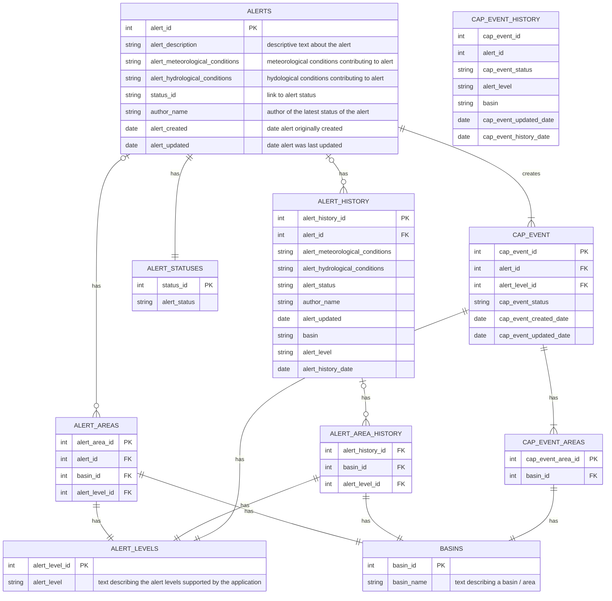

# Hydrological Advisory Alerting System (Haas) Database

Current database structure / data model used to store alert related information

# Tables

## ALERTS

This table stores the info about each individual alert.  

* author_name: gets populated by the name supplied in the JWT that authorized 
  editing of the record.
* alert_created: autogenerated
* alert_updated: autogenerated, updated every time the table changes.

## ALERT_HISTORY

This table records the previous state of the ALERT table before edits are saved.
Data for this table is generated by running a query that joins the related 
tables, creating new records for each ALERT/BASIN-ALERT LEVEL combination.

## CAP_EVENT

This table contains the CAP_EVENTS that are related to the Hydrological Events.
Hydrological events can have multiple area / advisory levels associated with them
CAP events cannot.

CAP events can be updated by having additional areas added to them, or having 
areas removed from them.

If the level associated with a CAP event changes it means the original CAP event
that contained the area needs to be updated, and that area removed, then a new
cap event is created for the area, with the new advisory level.

This table keep track of the CAP events that have been emitted.  The field
`cap_event_status` keeps track of the status of an event.  These can be:

* alert - used for newly created events
* updated - the event has been updated.  An area has been added or removed from 
            the event
* cancelled - the event has been concluded and is no longer active.

## CAP_EVENT_HISTORY

Keeps track of the status of a CAP_EVENT prior to any change.  This is a flat 
table.  

Query is run joining CAP_EVENT to BASINS and CAP_EVENT to ALERT_LEVELS.  This 
data is compared with the incoming data to identify records that have changed.
The original values for the records that have changed are recorded in this
table.

## ALERT_LEVELS

A prepopulated lookup table containing the alert levels used by the river 
forecast centre.

* High Streamflow Advisory
* Flood Warning
* Flood Watch

## ALERT_AREAS

A junction table between ALERTS and the related tables BASINS and ALERT_LEVELS.
A single alert will have a 1 to many relationship to this table.

## BASINS

A prepopulated table containing the BASINS used to delineate watersheds impacted
by the various advisories that are issued by the River Forecast Centre.

# Data Creation / Update Scenarios

This section describes how database changes will ultimately translate to the 
emitting of CAP events.  The current plan is to create an event queue that the
CAP feel system can consume.  The CAP feed system  will subscribe to the event
queue and will issue/update CAP events for each event that is consumed.

### Nomenclature
* CAP - Common Alerting protocol and/or Canadian Alerting protocol

* Advisory Level - This is the different advisory levels that the British Columbia
                   River Forecast Centre issues, to inform the public about 
                   hydrological hazard levels.

* Hydrological Event - an event that encompasses 1 or more geographic areas.
                       a hydrological event can have multiple alert levels 
                       associated with different areas that are effected by 
                       the event.  Hydrological events are defined by common
                       hydrological and or meteorological conditions that are
                       preciptating the need to issue some sort of advisory.

* CAP Event - a CAP event follows the requirements identified by the [common 
              alerting protocol](https://www.fema.gov/emergency-managers/practitioners/integrated-public-alert-warning-system/technology-developers/common-alerting-protocol) and the [canadian alerting protocol](https://www.publicsafety.gc.ca/cnt/mrgnc-mngmnt/mrgnc-prprdnss/capcp/index-en.aspx)
              A CAP event can contain multiple geographic areas, however they
              must all have the same Advisory levels.  Adding new areas to CAP
              Event constitutes and 'update'.  Changing the alert level for 
              a cap event, requires removing that area from an existing event, 
              and creating a new event for that area with the new advisory 
              level.

### New Alert

* New ALERT Record is created for Area-A and Area-B with a high streamflow
  advisory. (ALERT_AREAS is updated to build relationships to BASIN and 
  ALERT_LEVELS)
* New CAP_EVENT is created 
    * for each Advisory level in the current ALERT a new CAP_EVENT is created

Example:

Input data entered in the application

| Basin | Advisory |
|-------|----------|
| A     | HSA      |
| B     | HSA      |
| C     | HSA      |

* Creates a single ALERT Record, one to many relationship to ALERT_AREAS to store the area and the LEVEL data
* Creates two CAP_EVENT records, with two different CAP_EVENT ids.  (view below simplified)

| Cap_Event_id | Basin | Advisory | cap_event_status |
|--------------|-------|----------| ---------------- |
| 1            | A     | HSA      | alert            |
| 1            | B     | HSA      | alert            |
| 1            | C     | HSA      | alert            |

Caveats:
* the frontend will prevent a basin from being allocated to more than one alert

### Edit Alert - Scenario 1 - New Basin/Area added

The data is updated as follows

| Basin | Advisory | cap_event_created | cap_event_updated |
|-------|----------| ----------------- | ----------------- |
| A     | HSA      | Oct 3, 1962       | Oct 4, 1962       |
| B     | HSA      | Oct 3, 1962       | Oct 4, 1962       |
| C     | HSA      | Oct 3, 1962       | Oct 4, 1962       |
| D     | HSA      | Oct 4, 1962       | Oct 4, 1962       |

* the ALERT_HISTORY table will have the following data added, in a nutshell the 
  status of the table prior to the update.

simplified version (not all fields included), in a nutshell the status of this 
table before the update, and the update date is taking place Oct 3, 1962

| alert_id | alert_status | author_name | basin | alert_level | alert_history_date |
| -------- | ------------ | ----------- | ----- | ----------- | ------------------ |
| 1        | alert        | Mr. T       | A     | HSA         | Oct 3, 1962        |
| 1        | alert        | Mr. T       | B     | HSA         | Oct 3, 1962        |
| 1        | alert        | Mr. T       | C     | HSA         | Oct 3, 1962        |

* the CAP_EVENT table will get updated like this.  The update starts with a query
  of what is in the table at the time of the update.  The data is compared with 
  the new incoming data, the comparison identifies the status changes, and updates
  that field for existing records

| Cap_Event_id | Basin | Advisory | cap_event_status | cap_event_updated_date |
|--------------|-------|----------| ---------------- | ---------------------- |
| 1            | A     | HSA      | update           | Oct 4, 1962            |
| 1            | B     | HSA      | update           | Oct 4, 1962            |
| 1            | C     | HSA      | update           | Oct 4, 1962            |
| 1            | D     | HSA      | alert            | Oct 4, 1962            |

* the CAP_EVENT_HISTORY table will have the following records added to it. 
  Stores the state in the database before the update.

| Cap_Event_id | Basin | Advisory | cap_event_status | cap_event_history_date |
|--------------|-------|----------| ---------------- | ---------------------- |
| 1            | A     | HSA      | alert            | Oct 3, 1962            |
| 1            | B     | HSA      | alert            | Oct 3, 1962            |
| 1            | C     | HSA      | alert            | Oct 3, 1962            |

### Edit Alert - Scenario 2 - Change in Status of Area in existing Alert

In this scenario Basins A and B are moving from a HSA to a Flood Watch.  Basins
C and D are unchanged. Changes are taking place on Oct 5, 1962

The following is a summarized view of how the ALERT data will change

| Basin | alert_status | author_name | alert_created | alert_updated |
|-------|--------------| ----------- | ------------- | ------------- |
| A     | FW           | Rocky B.    | Oct 3, 1962   | Oct 5, 1962   |
| B     | FW           | Rocky B.    | Oct 3, 1962   | Oct 5, 1962   |
| C     | HSA          | Rocky B.    | Oct 3, 1962   | Oct 5, 1962   |
| D     | HSA          | Rocky B.    | Oct 3, 1962   | Oct 5, 1962   |

Then the CAP_EVENT table will be updated to this state:

| Cap_Event_id | Basin | Advisory | cap_event_status | cap_event_updated_date |
|--------------|-------|----------| ---------------- | ---------------------- |
| 1            | C     | HSA      | update           | Oct 4, 1962            |
| 1            | D     | HSA      | update           | Oct 4, 1962            |
| 2            | A     | FW       | alert            | Oct 4, 1962            |
| 2            | B     | FW       | alert            | Oct 4, 1962            |

