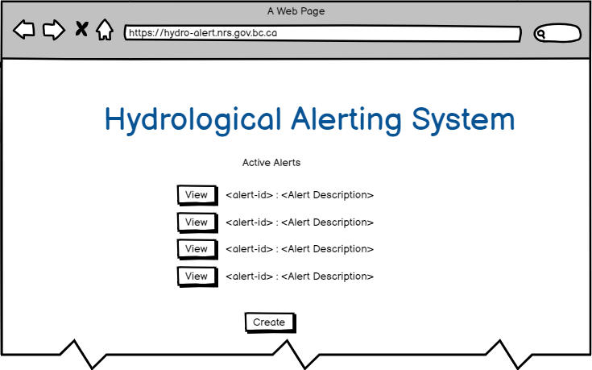
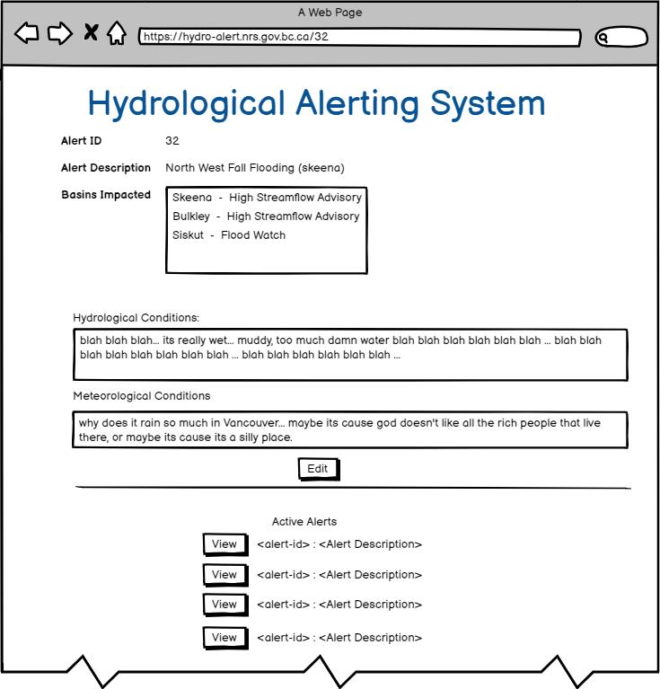

# Intro

These docs are intended to describe the plan for how the frontend is ultimately
going to look and function.  The goal of these docs is to help guide development

# Flow

## Authentication

Navigation to the domain for the app will redirect to Keycloak / single sign on
where the user will authenticate, and the app will return with the JWT.

The app will parse the JWT to ensure that user is authorized to use this app.

Mechanics of this to be worked out.

## Home Screen

The start page for the app will show all the current alert/advisories that are
active.

From here you can either create a new alert/advisory or edit and existing one.

To create new click on `create new` to edit click on the `view` button next to the 
event that you want to view.

## Create New

Create new allows you to author a net new alert.  It lacks an id field as that 
will get generated once the alert is created.  

Clicking on "Add new Basin / Advisory" will create a new set of select widgets 
with a list of basins and advisory levels.  Basins that have already been 
selected in this form will not show up in the list.  Basins that are already part
of another advisory will have a different color associated with them.  If you 
select a basin that has already been allocated to another alert you will get a
warning letting you know what advisory this basin is associated with, and the
option of removing it from that advisory in order to make it part of the current
advisory that is currently being authored.

Save will create the advisory and take you back to the home screen, where you 
will now see the new advisory as part of the list.

## View Event

This form will display the complete information associated with the event in a 
read only form.  At the bottom of the form there is an option for edit which
will re-present the same information but using form elements that allow for
editing.

View builds on the home screen and includes the ability to view any of the 
active advisory/alerts using the options at the bottom.

## Edit Event

Edit is pretty much the same form as the create form, except with data loaded
to the various components, allowing for edit.  The rest of the behaviour is the
same as create.

